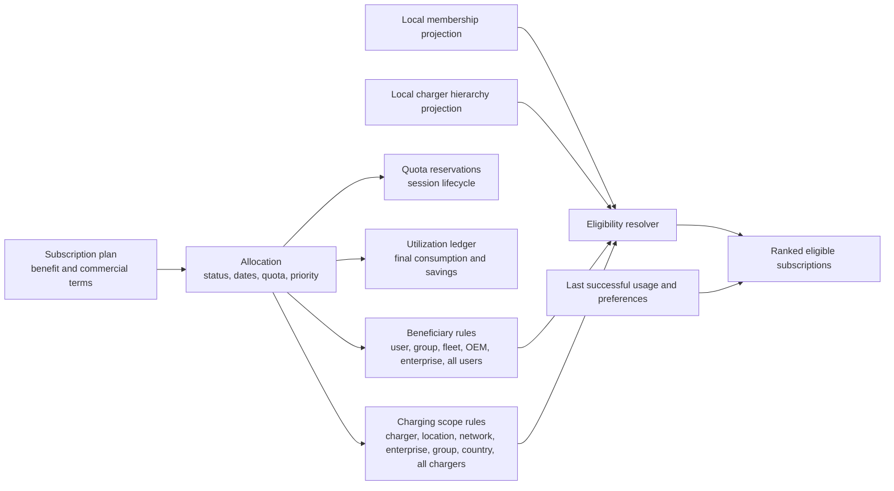
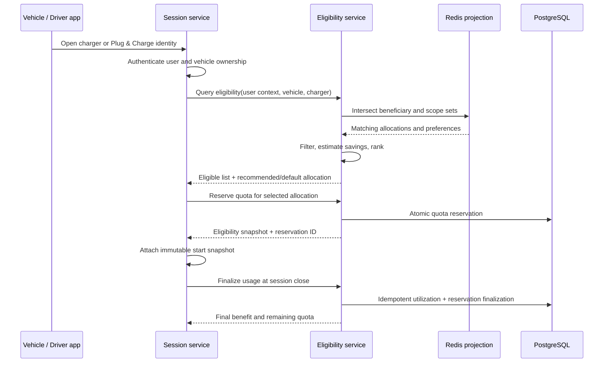

# Subscription eligibility and recommendation design

## 1. Purpose

This design supports subscriptions acquired from the public catalog or granted
by an administrator. A subscription can target an individual user, user group,
fleet, OEM population, enterprise population, or all eligible users. It can be
valid for a charger, location, network, enterprise charger estate, charger
group, country, or all chargers.

The latency-sensitive operation is:

> Given an authenticated driver, vehicle, and charger, return every eligible
> subscription, rank the recommendations, and choose a safe default.

The implementation must not scan all allocations. It must not call user,
charger, fleet, or OEM services synchronously in the charging-session hot path.

## 2. Performance and correctness targets

| Operation | Target |
|---|---:|
| Eligibility lookup, Redis hit | p95 < 20 ms, p99 < 50 ms |
| Eligibility lookup, PostgreSQL fallback | p95 < 100 ms |
| Plug & Charge default selection | p95 < 50 ms excluding certificate authentication |
| Public catalog search | p95 < 150 ms |
| Allocation or membership invalidation | visible within 5 seconds |
| Quota reservation | atomic; no overspend under concurrent sessions |

Correctness takes priority over a discount. If identity, scope, status, or quota
cannot be verified using Redis or PostgreSQL, the system fails closed and uses
regular pricing.

## 3. Core model

Separate the benefit, beneficiary, charging scope, acquisition, and usage.



An allocation is eligible only when all of these are true:

```text
active allocation
AND beneficiary rule matches driver principals
AND charging scope rule matches charger scopes
AND effective dates contain the session start
AND payment/renewal state permits use
AND quota is available
AND tenant boundaries match
AND optional connector/tariff restrictions match
```

## 4. PostgreSQL schema

### 4.1 Allocations

Extend `subscription_allocations` with:

```sql
acquisition_type       varchar(32) not null,
auto_apply_policy      varchar(32) not null,
priority               integer not null default 0,
tenant_id              uuid not null,
terms_version          varchar(64),
payment_status         varchar(32),
membership_version     bigint not null default 0,
scope_version          bigint not null default 0
```

Values:

```text
acquisition_type: PUBLIC_PURCHASE, PUBLIC_FREE, ADMIN_GRANT, FLEET_GRANT,
                  OEM_GRANT, ENTERPRISE_GRANT, PROMOTION
auto_apply_policy: MANUAL_SELECTION, RECOMMEND_ONLY, AUTO_APPLY
```

### 4.2 Beneficiary rules

```sql
create table subscription_beneficiaries (
    id uuid primary key,
    tenant_id uuid not null,
    allocation_id uuid not null references subscription_allocations(id),
    beneficiary_type varchar(32) not null,
    beneficiary_id uuid,
    created_at timestamptz not null,
    check (
        (beneficiary_type = 'ALL_USERS' and beneficiary_id is null) or
        (beneficiary_type <> 'ALL_USERS' and beneficiary_id is not null)
    )
);

create index idx_subscription_beneficiary_lookup
    on subscription_beneficiaries
       (tenant_id, beneficiary_type, beneficiary_id, allocation_id);
```

Types:

```text
USER, USER_GROUP, FLEET, OEM, ENTERPRISE, ALL_USERS
```

Multiple rows are OR conditions. An allocation granted to two fleets matches a
driver belonging to either fleet.

### 4.3 Charging scope rules

```sql
create table subscription_charging_scopes (
    id uuid primary key,
    tenant_id uuid not null,
    allocation_id uuid not null references subscription_allocations(id),
    scope_type varchar(32) not null,
    scope_id uuid,
    country_code char(2),
    created_at timestamptz not null,
    check (
        (scope_type = 'ALL_CHARGERS' and scope_id is null and country_code is null) or
        (scope_type = 'COUNTRY' and country_code is not null and scope_id is null) or
        (scope_type not in ('ALL_CHARGERS', 'COUNTRY') and scope_id is not null)
    )
);

create index idx_subscription_scope_lookup
    on subscription_charging_scopes
       (tenant_id, scope_type, scope_id, allocation_id);

create index idx_subscription_country_scope_lookup
    on subscription_charging_scopes
       (tenant_id, country_code, allocation_id)
    where scope_type = 'COUNTRY';
```

Types:

```text
CHARGER, LOCATION, NETWORK, ENTERPRISE, CHARGER_GROUP, COUNTRY, ALL_CHARGERS
```

### 4.4 Local identity and charger projections

The subscription service consumes ownership and membership events. These tables
are local read models, not systems of record.

```sql
user_principal_projection (
    tenant_id, user_id, principal_type, principal_id,
    valid_from, valid_until, source_version, updated_at
)

charger_scope_projection (
    tenant_id, charger_id, scope_type, scope_id,
    country_code, source_version, updated_at
)
```

Indexes:

```sql
create index idx_user_principal_user
    on user_principal_projection (tenant_id, user_id, valid_until);

create index idx_charger_scope_charger
    on charger_scope_projection (tenant_id, charger_id);
```

User principals include the user itself plus group, fleet, OEM, and enterprise
memberships. Charger scopes include the charger itself plus its location,
network, owning enterprise, groups, and country.

### 4.5 Preferences and successful use

```sql
driver_subscription_preferences (
    tenant_id,
    user_id,
    vehicle_id,
    context_type,
    context_id,
    allocation_id,
    auto_apply,
    selection_source,
    last_successful_session_id,
    last_used_at,
    updated_at,
    primary key (tenant_id, user_id, vehicle_id, context_type, context_id)
)
```

Context types are `CHARGER`, `LOCATION`, `NETWORK`, and `GLOBAL`. Successful
session usage updates the appropriate preference rows asynchronously.

### 4.6 Quota reservation

Do not decrement quota during every preview. Reserve quota when a session is
authorized and finalize it when the session closes.

```sql
subscription_quota_reservations (
    id uuid primary key,
    tenant_id uuid not null,
    allocation_id uuid not null,
    session_id uuid not null,
    reserved_value numeric(19,4) not null,
    consumed_value numeric(19,4),
    status varchar(32) not null,
    expires_at timestamptz not null,
    created_at timestamptz not null,
    updated_at timestamptz not null,
    unique (tenant_id, session_id)
)
```

Reservation states are `HELD`, `FINALIZED`, `RELEASED`, and `EXPIRED`.

## 5. Redis eligibility index

PostgreSQL remains authoritative. Redis contains a rebuildable projection used
for the hot path. All keys for a tenant use a Redis Cluster hash tag so a Lua
function can operate atomically within one slot.

```text
sub:{tenant}:beneficiary:USER:{userId}             -> Set<allocationId>
sub:{tenant}:beneficiary:USER_GROUP:{groupId}      -> Set<allocationId>
sub:{tenant}:beneficiary:FLEET:{fleetId}           -> Set<allocationId>
sub:{tenant}:beneficiary:OEM:{oemId}               -> Set<allocationId>
sub:{tenant}:beneficiary:ENTERPRISE:{enterpriseId} -> Set<allocationId>
sub:{tenant}:beneficiary:ALL_USERS:*                -> Set<allocationId>

sub:{tenant}:scope:CHARGER:{chargerId}              -> Set<allocationId>
sub:{tenant}:scope:LOCATION:{locationId}            -> Set<allocationId>
sub:{tenant}:scope:NETWORK:{networkId}              -> Set<allocationId>
sub:{tenant}:scope:ENTERPRISE:{enterpriseId}        -> Set<allocationId>
sub:{tenant}:scope:CHARGER_GROUP:{groupId}          -> Set<allocationId>
sub:{tenant}:scope:COUNTRY:{countryCode}            -> Set<allocationId>
sub:{tenant}:scope:ALL_CHARGERS:*                   -> Set<allocationId>

sub:{tenant}:allocation:{allocationId}              -> Hash<compiled allocation>
sub:{tenant}:user-principals:{userId}               -> Set<type:id>
sub:{tenant}:charger-scopes:{chargerId}             -> Set<type:id>
sub:{tenant}:preference:{userId}:{vehicleId}        -> Hash<context -> allocationId>
sub:{tenant}:version                                -> integer
```

An event-driven projector updates Redis after the database transaction commits.
Every Redis key must have a TTL. Permanent Redis keys are prohibited, including
sets, hashes, version keys, presence markers, preferences, locks, negative-cache
entries, and quota holds. PostgreSQL remains the source of truth and every hard
cache miss is populated on demand using indexed PostgreSQL queries.

### 5.1 TTL policy

| Key class | Soft TTL | Hard Redis TTL |
|---|---:|---:|
| User principal projection | 2 minutes | 5 minutes + jitter |
| Charger scope projection | 2 minutes | 5 minutes + jitter |
| Beneficiary and scope allocation sets | 2 minutes | 5 minutes + jitter |
| Compiled allocation hash | 5 minutes | 10 minutes + jitter |
| Driver preference | 1 minute | 2 minutes + jitter |
| Complete eligibility response | 15 seconds | 30 seconds + jitter |
| Negative lookup | 5 seconds | 15 seconds + jitter |
| Refresh lock | Not applicable | 5 seconds |
| Quota hold | Reservation expiry | Reservation expiry + 60 seconds |
| Tenant/version marker | 30 minutes | 60 minutes + jitter |

Use random jitter of up to 10% so a large fleet, location, or network does not
expire simultaneously. The cache abstraction must use commands that set the
value and TTL atomically (`SET ... EX`, a Lua function, or a transaction). It
must never call `SET`, `SADD`, or `HSET` without applying an expiration in the
same logical operation.

Redis keyspace audits run periodically and expose a gauge for keys whose TTL is
`-1`. The acceptance value for subscription-owned keys without a TTL is zero.

### 5.2 Presence markers and empty results

A missing set cannot mean "no subscriptions" because it may have expired. Each
loaded projection has an expiring presence marker containing its source version
and load timestamp:

```text
sub:{tenant}:loaded:user-principals:{userId}
sub:{tenant}:loaded:charger-scopes:{chargerId}
sub:{tenant}:loaded:beneficiary:{type}:{id}
sub:{tenant}:loaded:scope:{type}:{id}
sub:{tenant}:loaded:allocation:{allocationId}
```

An absent set plus a valid presence marker with `resultCount=0` is a known empty
result because Redis does not retain empty sets. An absent set without a valid
presence marker is a cache miss and triggers PostgreSQL read-through. Presence
markers always expire with or before the related data keys.

### 5.3 Read-through and refresh-ahead

Every lookup follows this policy:

1. Read the projection data and presence markers in one pipeline.
2. If any required marker or data key is absent, fetch the missing projection
   from PostgreSQL using its indexed query.
3. Rebuild all related Redis keys and TTLs atomically.
4. Continue eligibility evaluation using the freshly loaded data.
5. If the key exists but is past its soft TTL, serve it for this request and
   schedule an asynchronous refresh.
6. Never serve data after the hard Redis TTL; a hard miss must read through to
   PostgreSQL before returning an eligibility decision.

This provides fetch-on-demand behavior while refresh-ahead prevents most user
requests from paying the database latency.

### 5.4 Stampede protection

Use an expiring single-flight lock for each projection:

```text
sub:{tenant}:refresh-lock:{projectionType}:{entityId}
```

The first caller acquires it with `SET key token NX PX 5000` and refreshes from
PostgreSQL. Other callers wait briefly for the populated marker, then either use
the result or execute the indexed PostgreSQL fallback themselves. Lock release
uses a compare-and-delete Lua function so one caller cannot release another
caller's lock. A lock is an optimization only; correctness never depends on it.

### 5.5 Write-through invalidation

Allocation creation, pause, revocation, cancellation, payment failure, scope
change, and beneficiary change update PostgreSQL and publish an outbox event.
The local service deletes or replaces affected Redis keys immediately after the
transaction commits; event consumers repeat the invalidation for recovery.

TTL is the final recovery mechanism when invalidation is delayed, not the main
consistency mechanism. Quota reservation and final utilization always perform
an atomic PostgreSQL check of allocation state and remaining quota even when the
eligibility candidates came from Redis.

## 6. Fast lookup algorithm

Input:

```text
tenantId, authenticatedUserId, vehicleId, chargerId, connectorId,
sessionId, timestamp, estimatedEnergyKwh
```

### 6.1 Candidate retrieval

1. Read the driver's principal set and presence marker from Redis.
2. Read the charger's scope set and presence marker from Redis.
3. Read through to indexed PostgreSQL and repopulate Redis if either projection
   is missing or has reached its hard TTL.
4. Union allocation IDs for every matching beneficiary key.
5. Union allocation IDs for every matching charging-scope key.
6. Intersect the two unions.
7. Fetch compiled allocation hashes with one pipelined request, reading through
   for any missing allocation hashes.

The union and intersection should run in a read-only Redis Lua function using
temporary in-memory tables, not persisted temporary keys. Candidate count is
bounded; if it exceeds 500, record a configuration warning and use a bounded
PostgreSQL fallback.

Conceptually:

```text
beneficiaryCandidates = UNION(
  USER:userId,
  every USER_GROUP membership,
  every FLEET membership,
  OEM membership,
  ENTERPRISE memberships,
  ALL_USERS
)

scopeCandidates = UNION(
  CHARGER:chargerId,
  LOCATION:locationId,
  NETWORK:networkId,
  ENTERPRISE:chargerEnterpriseId,
  every CHARGER_GROUP membership,
  COUNTRY:countryCode,
  ALL_CHARGERS
)

candidates = INTERSECT(beneficiaryCandidates, scopeCandidates)
```

### 6.2 Hard eligibility filters

Filter candidates in memory by:

- allocation and plan status;
- start and end timestamps;
- payment or renewal status;
- connector/tariff restrictions;
- remaining quota minus active reservations;
- tenant ID;
- acquisition-specific conditions;
- Plug & Charge auto-apply policy.

The endpoint returns all passing allocations, not only the selected one.

### 6.3 Ranking

Rank eligible allocations deterministically:

1. Exact last successful allocation for user + vehicle + charger.
2. User's explicit preference for this charger.
3. Last successful allocation at this location.
4. Explicit location preference.
5. Last successful allocation on this network.
6. Explicit global preference.
7. Highest estimated savings.
8. Highest allocation priority.
9. Earliest expiration.
10. Allocation UUID as a stable tie-breaker.

`recommended=true` identifies the first result. `selectedByDefault=true` is set
only when its auto-apply policy and the channel allow automatic application.

### 6.4 Complexity

Lookup cost depends on the driver's memberships, charger hierarchy, and matching
allocations. It does not depend on total subscriptions in the platform.

```text
O(driver principals + charger scopes + matching allocations)
```

## 7. PostgreSQL fallback query

Redis failure must not cause a full-table scan. Load principal and scope tuples,
then join through their composite indexes:

```sql
select distinct a.id
from subscription_allocations a
join subscription_beneficiaries b on b.allocation_id = a.id
join subscription_charging_scopes s on s.allocation_id = a.id
where a.tenant_id = :tenant_id
  and (b.beneficiary_type, b.beneficiary_id) in (:principal_tuples)
  and (
       (s.scope_type, s.scope_id) in (:scope_tuples)
       or (s.scope_type = 'COUNTRY' and s.country_code = :country_code)
       or s.scope_type = 'ALL_CHARGERS'
  )
  and a.status = 'ACTIVE'
  and a.starts_at <= :now
  and (a.ends_at is null or a.ends_at > :now)
order by a.priority desc
limit 500;
```

Represent `ALL_USERS` as an additional principal tuple rather than an `OR` that
prevents index use.

## 8. APIs

### 8.1 Public catalog

```http
GET  /api/v1/driver/subscription-plans
GET  /api/v1/driver/subscription-plans/{planId}/eligibility
POST /api/v1/driver/subscriptions
POST /api/v1/driver/subscriptions/{allocationId}/cancel
```

Public catalog lookup is separate from session eligibility. It uses plan search
indexes and may show plans the driver can purchase, whereas charger eligibility
returns only acquired or granted allocations ready for use.

### 8.2 Charger screen

```http
POST /api/v1/subscriptions/eligibility/query
```

```json
{
  "vehicleId": "vehicle-id",
  "chargerId": "charger-id",
  "connectorId": "connector-id",
  "sessionId": "optional-session-id",
  "estimatedEnergyKwh": 25.0
}
```

The authenticated user and tenant come from the service identity context, never
from a trusted client field.

Response:

```json
{
  "eligibilityVersion": "tenant-version:allocation-version",
  "subscriptions": [
    {
      "allocationId": "allocation-id",
      "planCode": "FREE_CHARGING_USER_GRANT",
      "eligible": true,
      "recommended": true,
      "selectedByDefault": true,
      "selectionSource": "LAST_CHARGING_SESSION",
      "recommendationReason": "Used successfully at this charger",
      "estimatedSavings": 14.25,
      "remainingQuota": 82.5,
      "quotaUnit": "KWH"
    }
  ]
}
```

### 8.3 Selection and reservation

```http
POST /api/v1/subscriptions/selections
POST /api/v1/subscriptions/quota-reservations
POST /api/v1/subscriptions/quota-reservations/{sessionId}/finalize
DELETE /api/v1/subscriptions/quota-reservations/{sessionId}
```

Every mutating endpoint requires an idempotency key based on the session ID.

## 9. Session and Plug & Charge flow



For Plug & Charge, automatic selection requires all of the following:

- certificate-to-vehicle mapping is valid;
- vehicle ownership or authorized-driver mapping is valid;
- allocation is eligible at the current charger;
- `auto_apply_policy = AUTO_APPLY`;
- the previous successful allocation is still valid;
- quota reservation succeeds.

If the previous allocation is invalid, evaluate the next ranked auto-applicable
allocation. Otherwise use regular pricing. Recommendation never creates an
enrollment or grant.

## 10. Session snapshot and cached calculation

Persist on the session:

```text
allocation ID, plan ID, eligibility version, selection source,
user ID, vehicle ID, charger hierarchy, fee coverage,
discount type/value, quota at start, reservation ID,
terms version, evaluated timestamp
```

Both live and cached calculations must understand all discount types, including
`ALL_FEES_PERCENTAGE`. The cached path must apply the benefit to energy, time,
session, and idle components in the same proportion as covered energy while
excluding taxes. Share one pricing library or contract tests between session and
subscription services to prevent divergence.

## 11. Consistency and invalidation

Publish events through a transactional outbox:

```text
SubscriptionAllocationChanged
SubscriptionBeneficiaryChanged
SubscriptionChargingScopeChanged
UserMembershipChanged
VehicleOwnershipChanged
ChargerHierarchyChanged
SubscriptionPreferenceChanged
SubscriptionQuotaChanged
```

Consumers update PostgreSQL projections first and then Redis with a new TTL.
Every projection has a monotonically increasing source version. Ignore duplicate
and older events. Delete affected user+charger result-cache entries or increment
the tenant eligibility version. If an event is missed, expiration plus
read-through reconstructs the projection from PostgreSQL when next required.

Do not cache final eligibility responses for long periods. A 15-30 second
result cache is acceptable for charger-screen refreshes, keyed by:

```text
tenant + user + vehicle + charger + membershipVersion +
chargerScopeVersion + eligibilityVersion
```

Quota availability is read at reservation time and is never trusted solely from
the result cache.

## 12. Observability

Record:

- lookup latency and Redis hit rate;
- Redis hard misses, read-throughs, and refresh-ahead operations;
- Redis keys without TTL, which must remain zero;
- refresh-lock contention and database fallback after lock timeout;
- candidate count before and after filtering;
- rejection reason counts;
- PostgreSQL fallback rate;
- projection lag and event version gaps;
- quota reservation conflicts;
- recommendation acceptance rate;
- default-selection override rate;
- discount preview/finalization differences.

Add an admin explain endpoint that returns matched principals, charger scopes,
rejected allocations, and machine-readable rejection reasons without exposing
another tenant's data.

## 13. Security

- Derive user and tenant from authenticated service context.
- Resolve charger hierarchy from the local authoritative projection.
- Validate Plug & Charge certificate and vehicle ownership before lookup.
- Enforce tenant ID on every table, key, query, and event.
- Audit public enrollment, admin grants, automatic selection, overrides,
  reservations, utilization, cancellation, pause, and revocation.
- Never auto-enroll a user because a plan is recommended.

## 14. Delivery plan

1. Add beneficiary, charging-scope, preference, projection, and reservation
   tables without changing current behavior.
2. Backfill existing `USER`, `ORGANIZATION`, and `ORGANIZATION_GROUP`
   allocations into beneficiary rules; use `ALL_CHARGERS` for existing plans.
3. Consume membership and charger-hierarchy events into PostgreSQL projections.
4. Build the Redis projector and indexed PostgreSQL fallback.
5. Add the mandatory-TTL cache wrapper, presence markers, PostgreSQL
   read-through, refresh-ahead, and stampede protection.
6. Add eligibility query and explain endpoints behind a feature flag.
7. Update session service to send charger context and persist eligibility
   snapshots.
8. Unify cached and final pricing behavior, including all-fees discounts.
9. Add public enrollment and admin scope controls.
10. Run shadow lookups in production and compare decisions without applying
   benefits.
11. Enable individual-user plus individual-charger grants.
12. Expand to location, network, group, fleet, OEM, and enterprise scopes.
13. Enable `ALL_USERS` and `ALL_CHARGERS` only after cardinality, quota, and
    tenant-isolation load tests pass.

## 15. Acceptance tests

- One user at one charger and rejection at every other charger.
- Publicly purchased plan and admin-granted plan on the same charger.
- User group, fleet, OEM, and enterprise membership matching.
- Location, network, charger group, enterprise, country, and all-chargers scope.
- Last successful subscription recommendation and Plug & Charge default.
- Previous subscription expired, paused, revoked, unpaid, or exhausted.
- Manual override and remembered preference.
- Concurrent sessions cannot overspend quota.
- Membership and charger ownership changes invalidate eligibility within five
  seconds.
- Redis unavailable uses indexed PostgreSQL fallback without a full scan.
- Every subscription-owned Redis key has a positive TTL.
- Expired user, charger, allocation, preference, and empty-result keys are
  fetched from PostgreSQL and repopulated when requested.
- Concurrent misses for the same projection do not create an uncontrolled
  database stampede.
- Missed invalidation events recover through TTL expiration and read-through.
- Cross-tenant identifiers never produce candidates.
- Cached and finalized all-fees pricing produce the same result.
- Load test at expected peak plus 3x headroom while meeting the latency targets.
